# 게시판 만들기

Vue.js 와 데이터베이스(MySQL), 클라우드 서버(AWS) 학습을 주 목적으로 진행하는 프로젝트 입니다.

문서는 공부한 내용을 정리하는 방식으로 작성합니다.

일별 개발 일지는 [./record]() 에 저장합니다.

<br />

## 목차

- [Frontend](#Frontend)
  - [vue-router](#Vue-Router)
  - [axios를 이용한 API 요청](#axios로-API-요청)
  - [Webpack Proxy 설정](#Webpack-Proxy-설정)
- [Backend](#Backend)
  - [node.js mysql](#Node.js-MySQL)
  - [Express Generator](#Express-Generator)
  - [pm2](#pm2)
- [데이터베이스](#데이터베이스)
- [AWS](#AWS)
  - [RDS 서버 생성하기](#RDS-서버-생성하기)
  - [RDS 서버 접속하기](#RDS-인스턴스에-접속해보기)
  - [mariaDB 한글 입력 오류 해결 방법](#mariaDB-한글-입력-오류-해결-방법)

<br />

## 목표

### 8월 25일

- AWS RDS
  - 데이터베이스 서버 구축
  - 원격 API 요청에 대한 데이터 응답
- 백엔드 코드 리팩토링

---

## Frontend

### Vue Router

문서 작업 예정

<br />

### axios로 API 요청

우선 axios 를 설치합니다.

```
$ npm install axios
```

모듈을 사용하기 위해서 `app.js` 에 등록해줍니다

```javascript
// ./src/app.js

import axios from 'axios';
import VueAxios from 'vue-axios';

createApp(App).use(VueAxios, axios).mount(#app);
```

이제 특정 컴포넌트에서 API 요청을 해보겠습니다.

```html
<script>
  export default {
    data() {
      return {
        message: "",
      };
    },
    created() {
      this.$http.get("https://localhost:3000").then((response) => {
        this.message = response.data;
      });
    },
  };
</script>
```

`localhost:3000` 로 부터 응답을 받아 `message` 에 대입 시키는 아주 간단한 코드입니다.

하지만 이렇게 API 요청을 보내면 에러가 발생합니다. CORS (Cross Origin Resource Sharing)이라고 하는 브라우저-서버 간의 보안 정책 때문입니다. 현재는 localhost로 같은 도메인임에도 불구하고 포트번호가 8080과 3000으로 다르기 떄문에 다른 서버로 인식하는 듯 합니다.

이를 해결하기 위해 Webpack 개발 서버에서 api 서버로 프록싱을 합니다.

[Webpack Proxy 설정](#Webpack-Proxy-설정)

위에서 axios 모듈을 이용하여 get 방식으로 API 요청을 하는 예제 코드를 작성했습니다. <br />
아래는 post 방식으로 API 요청을 하는 예제 코드 입니다.

```html
<script>
  export default {
    data() {
      return {
        title: "Vue.js",
        description: "Vue.js is ...",
      };
    },
    addContent() {
      this.$http
        .post("/api/insert", {
          title: this.title,
          description: this.description,
        })
        .then((response) => {
          console.log(response);
        });
    },
  };
</script>
```

`$http.post()` 메서드의 두번째 인자로 보낼 데이터를 객체 형식으로 지정합니다.

<br />

### Webpack Proxy 설정

`webpack.config.js` 의 devServer에 proxy 속성을 추가합니다.

```javascript
// ./webpack.config.js

module.exports = {
  // ....
  devServer: {
    proxy: {
      "/api": "http://localhost:3000",
    },
  },
};
```

개발 서버에 들어온 모든 http 요청 중 /api 로 시작되는 것은 모두 `http://localhost:3000`로 요청하도록 하는 설정이다.

`webpack.config.js` 를 수정한 후에는 아래와 같이 앱에서 API 요청을 할 수 있게 된다.

```html
<script>
  export default {
    data() {
      return {
        message: "",
      };
    },
    created() {
      this.$http.get("/api").then((response) => {
        // get 메서드에 url을 입력한 부분
        this.message = response.data;
      });
    },
  };
</script>
```

<br />

---

## Backend

### Express Generator

express-generator 를 이용하여 백엔드 개발 환경을 간단히 구축해 보겠습니다.

설치 및 앱 구동까지를 아래의 커맨드로 구현합니다.

```bash
$ npm i express-generator -g
$ express backend --view=pug
$ cd backend
$ npm i
$ npm start
```

```javascript
// ./bin/www

var app = require("../app");
var debug = require("debug")("backend:server");
var http = require("http");

var port = normalizePort(process.env.PORT || "3000");
app.set("port", port);
```

`bin/www` 의 내용을 보니 3000번 포트에서 동작합니다. `localhost:3000` 에서 동작하는지 웹 브라우저를 열어 확인해봅니다.

`app.js` 에는 사용자 접속 시 입력한 url마다 어떻게 라우팅 시킬 것인지에 대한 설정이 보입니다. `localhost:3000/` 와 `localhost:3000/users` 로 접속하였을 때에 `indexRouter`, `usersRouter` 에 연결되는 것을 알 수 있습니다.

```javascript
var express = require("express");
var app = express();

var indexRouter = require("./routes/index");
var usersRouter = require("./routes/users");

app.use("/", indexRouter);
app.use("/users", usersRouter);
```

`./routes/index.js` 를 살짝 수정해 봅니다. `localhost:3000` 로 접속 시 'Hello World!' 를 응답 데이터로 보내보겠습니다.

```javascript
var express = require("express");
var router = express.Router();

router.get("/", function (req, res, next) {
  res.send("Hello World!");
});

module.exports = router;
```

브라우저에서 `localhost:3000` 로 접속해보면 Hello World! 가 잘 출력되는 것을 볼 수 있습니다.

<br />

### Node.js MySQL

Node.js 환경에서 mysql 을 제어하기 위해 패키지를 설치합니다.

```
$ npm install mysql
```

`localhost:3000` 에 접속하면 데이터베이스의 내용을 출력하도록 코드를 수정해보겠습니다.

현재 localhost의 데이터베이스 서버에는 tutorial 이라는 db가 존재하고 그 안에는 `contents`, `comments` 라고 하는 스키마들이 저장되어 있습니다.

```
host: localhost
user: root
password: 111111
```

contents 의 내용은 아래와 같습니다.
id | title | description | author | created | updated
-|-|-|-|-|-
8 |HTTP |HTTP is HyperText Transfer Protocol ! | 2021-08-23 15:21:27 |2021-08-23 15:21:46
10 |CSS |CSS is ... |moonsdog| 2021-08-23 16:03:22 |2021-08-23 16:03:22
11 |Javascript |Javascript is ...| akaps |2021-08-23 16:46:18| 2021-08-23 16:46:18
12 |Node.js |Node.js is ... |egoing |2021-08-23 16:46:33 2021-08-23 |16:46:33

`./routes/index.js` 의 코드를 수정합니다.

```javascript
// ... require parts (생략)
var mysql = require("mysql");

router.get("/", function (req, res, next) {
  var connection = mysql.createConnection({
    host: "localhost",
    user: "root",
    password: "111111",
    database: "tutorial",
  });

  connection.query(`SELECT * FROM contents`, (err, contents) => {
    if (err) throw err;
    res.send(contents);
  });
});

module.exports = router;
```

- require로 mysql 모듈 가져오기
- `mysql.createConnection()` 메서드로 db server에 연결 및 tutorial db 를 사용하도록 함.
- `createConnection().query()` 메서드로 쿼리문 실행. 메서드의 두 번째 인자인 콜백 함수의 두 번째 인자 결과값을 내부에서 api 응답으로 전송.

코드를 작성한 후 `localhost:3000` 에 접속하면 contents 테이블의 내용이 json 의 형태로 출력되는 것을 확인할 수 있습니다.

<br />

### pm2

SSH Section 을 종료하더라도 서버가 계속 돌아가도록 PM2 프로세스 관리자를 사용합니다.

설치

```
npm install pm2 -g
```

명령어
동작 | 명령어
-|-
실행 | pm2 start app.js
리스트 확인 | pm2 list
중지 | pm2 stop app
재시작 | pm2 restart app
삭제 | pm2 delete app
로그확인 | pm2 log

- 서버를 실행할 때 --watch 옵션을 붙히면 코드를 수정하였을 때 서버가 알아서 재시작된다.
- ex) pm2 start app.js --watch

  <br />

---

## 데이터베이스

데이터베이스에 대한 노트는 아래 문서로 우선 대체합니다.

[데이터베이스(MySQL) 문서로 이동](https://github.com/hyunwoo045/vue3-board/tree/master/docs/mysql/database)

<br />

---

## AWS

AWS에 대한 노트는 아래 문서로 우선 대체합니다.

[AWS 문서로 이동](https://github.com/hyunwoo045/vue3-board/tree/master/docs/aws)

### RDS 서버 생성하기

1. 서비스 - 데이터베이스 - RDS 를 클릭

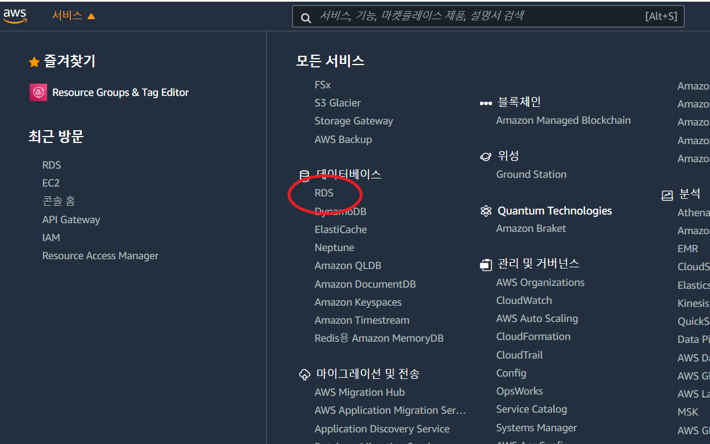

2. 좌측 데이터베이스 클릭 - 데이터베이스 생성 클릭

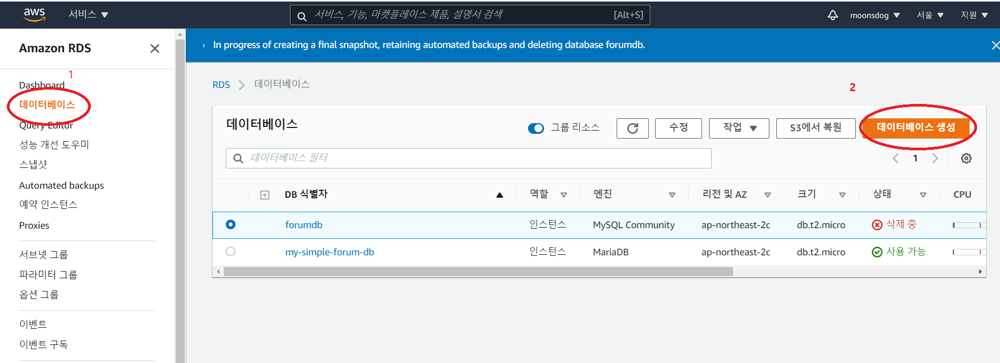

3. MariaDB 를 사용해 봅니다. MariaDB 클릭

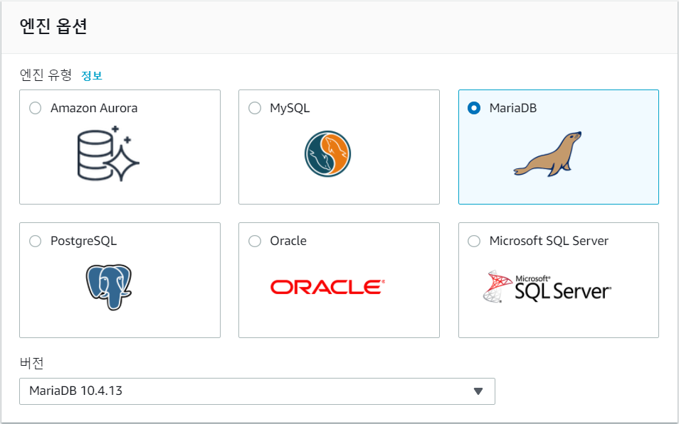

4. 설정

- 식별자 이름, 마스터 사용자 이름과 암호를 입력합니다.
- 마스터 사용자 이름과 암호의 경우 예전 기본 예시에서의 `root` 와 비밀번호, 즉 데이터베이스에 접속할 때에 필요한 id, password 이니 기억해둡니다.

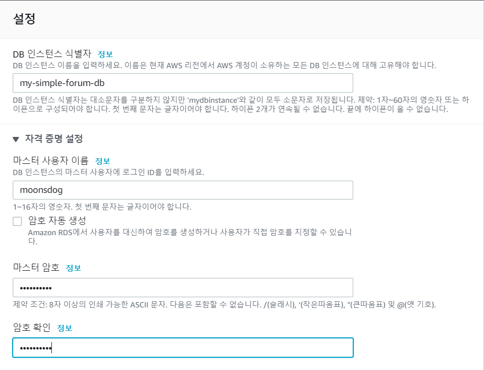

5. 연결

- 퍼블릭 엑세스를 `예`로 지정합니다. 원격 제어가 가능하게 하기 위해서입니다.

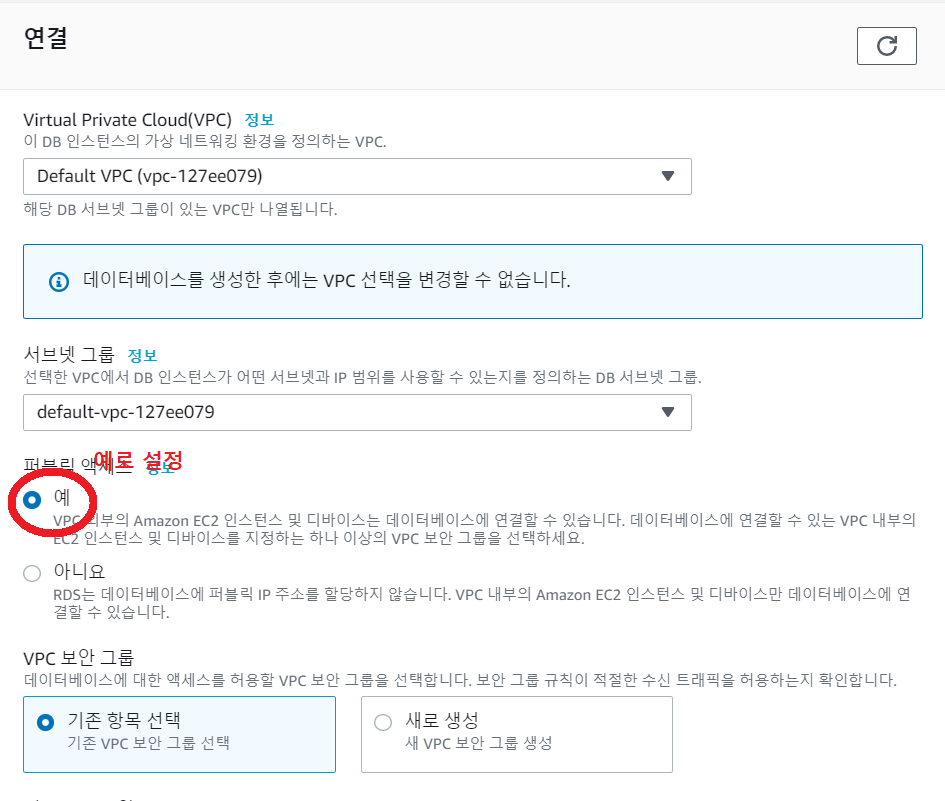

6. 데이터베이스 옵션

- default database를 하나 생성합니다.

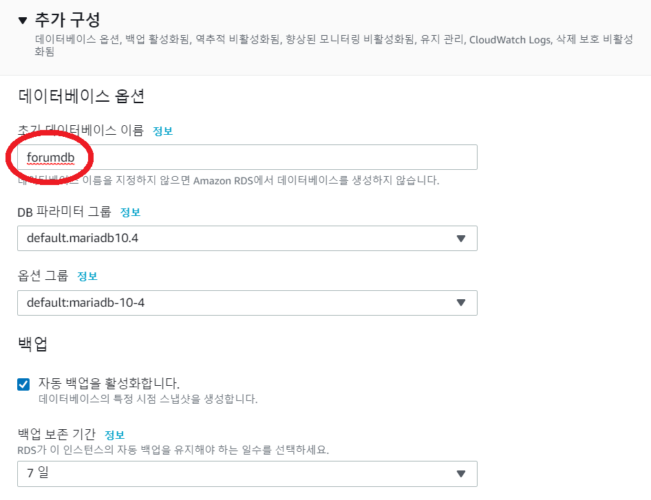

<br />

또한 원격 제어가 가능하도록 추가 설정을 해주어야 합니다.

- Amazon RDS 페이지 - 데이터베이스 - DB 식별자 클릭

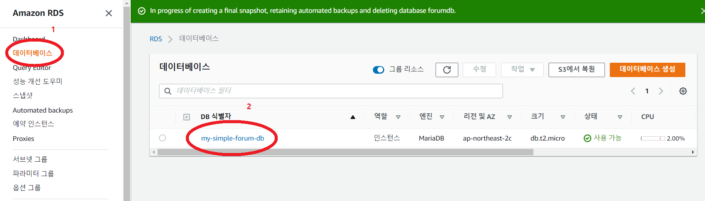

- 연결 & 보안 탭 - 보안 에 VPN 보안 그룹이 있습니다. 아래 클릭 가능한 링크를 클릭

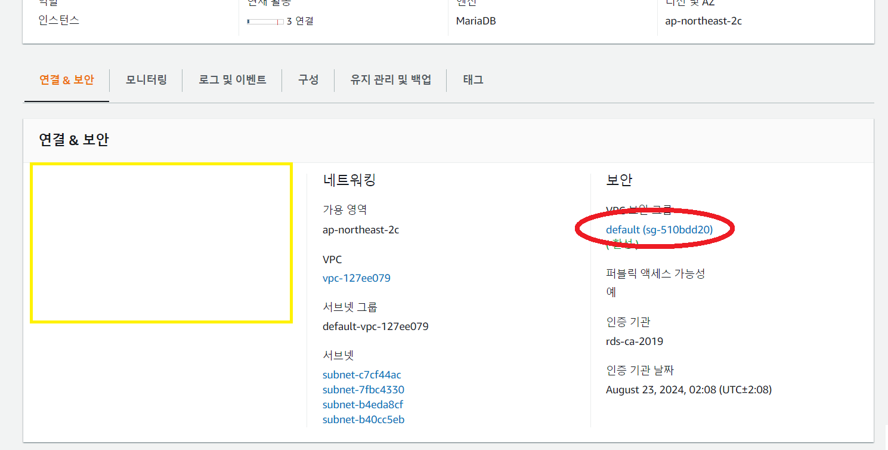

- 아래 인바운드 규칙 - Edit inbound rules 클릭

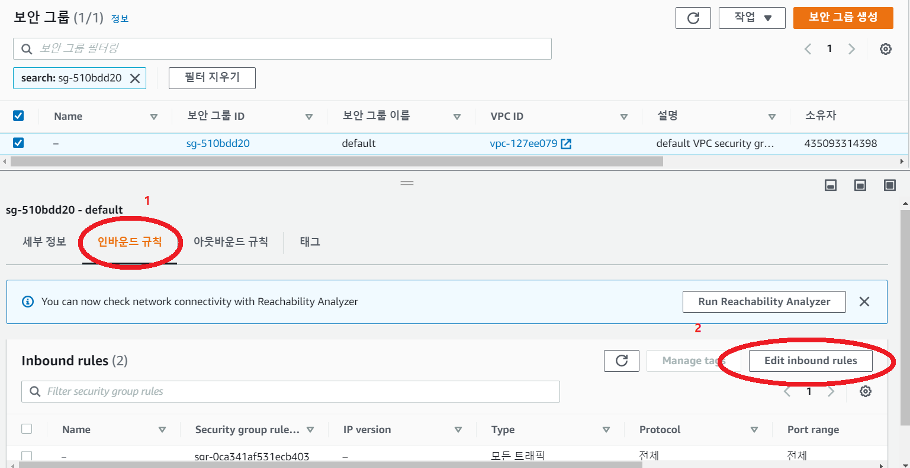

- 모든 TCP에 대한 접속을 허용합니다.
  - 규칙 추가 - 유형에 모든 TCP - 소스에 어디서든 - 규칙 저장 클릭

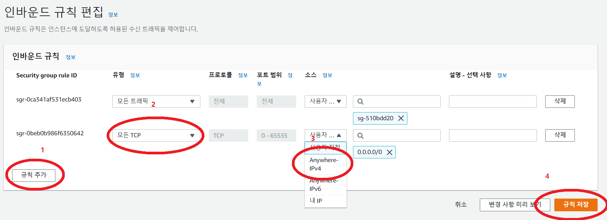

### RDS 인스턴스에 접속해보기

MySQL Workbench 에서 접속을 시험해 보겠습니다.

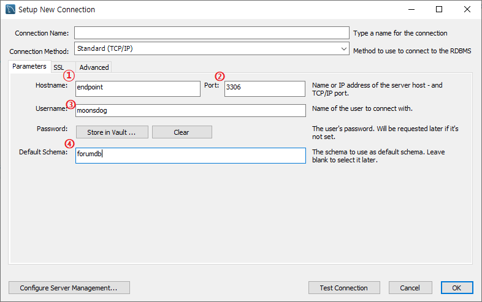

1. RDS 인스턴스의 엔드포인트
2. 포트
3. 마스터 사용자 이름
4. DB 이름

OK 를 클릭하면 패스워드를 입력하는 창이 뜹니다. 패스워드를 입력하면 정상적으로 DB에 접속하게 됩니다.

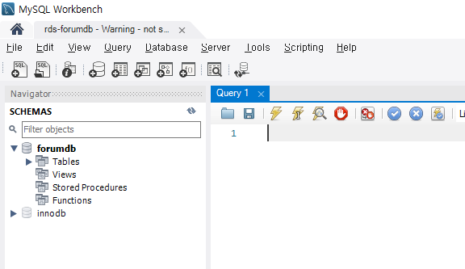

<br />

### mariaDB 한글 입력 오류 해결 방법

로컬 DB 환경에서는 잘 되던 한글 입력이 어째서인지 RDS mariaDB 인스턴스에서는 되지 않습니다.

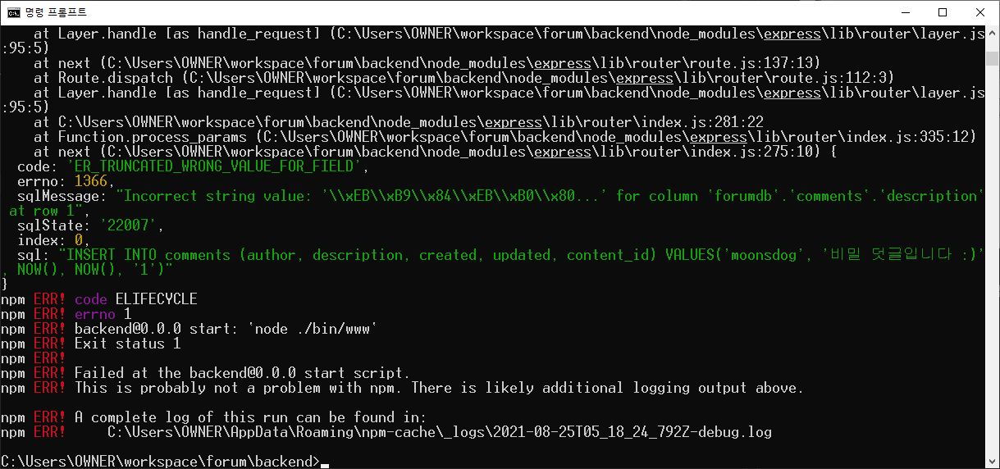

AWS RDS 에서는 DB 를 생성할 때 속성으로 파라미터 그룹을 지정하게 되어 있고, 이 그룹 안에 character-set 도 있습니다. 이 그룹을 default 로 지정하게 되었을 때에 latin... 이 지정되어 한글이 깨지는 현상이 발생합니다.

구글링을 통하여 해결하였습니다.

[AWS mariaDB 한글 세팅](https://twofootdog.tistory.com/62)
