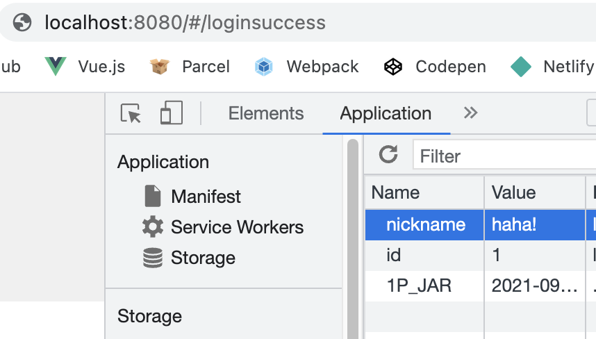

## Passport 를 이용한 소셜 로그인

Passport 로 소셜 로그인을 구현하였습니다. Passport 는 Strategy 에 따른 요청에 인증하기 위한 목적으로 사용되는 패키지이며, routes, DB 등을 mount 하지 않고 application-level 에서 결정할 수 있어 유연하고, 인증 성공/실패 시 어떤 제어를 할지 결정하는 것이 용이하다는 장점이 있습니다. <s>그냥 사용하기 편하다.</s>

구글, 카카오 로그인이 현재 구현되어 있는 상태이며, 어떻게 구현되었는지, 어떤 문제가 있었는지 기록하겠습니다.

### 설치

- passport 기본 패키지
- google, kakao Strategy 를 사용하기 위한 추가 패키지들 (`passport-google-oauth2`, `passport-kakao`)

```
$ npm install passport passport-google-oauth2 passport-kakao
```

설치가 끝나면 `./app.js`에 등록해 줍니다. 세션 유지를 위한 기능은 자체적으로 구현한 JWT 로 할 것이기 때문에 별달리 서술하지 않겠습니다. 세션에 관한 내용은 후에 [여기](https://dev-dain.tistory.com/73) 를 참고하여 공부하고 구현해보도록 하겠습니다.

```javascript
const passport = require("passport");
const GoogleStrategy = require("passport-google-oauth2").Strategy;
const KakaoStrategy = require("passport-kakao").Strategy;

app.use(passport.initialize());
app.use(passport.session());

passport.serializeUser((user, done) => {
  done(null, user.id);
});
passport.deserializeUser((id, done) => {
  done(null, id);
});

passport.use(
  new GoogleStrategy(
    {
      clientID: GOOGLE_CLIENT_ID,
      clientSecret: GOOGLE_CLIENT_SECRET,
      callbackURL: "http://localhost:3000/api/auth_social/google/callback",
      passReqToCallback: true,
    },
    async (request, accessToken, requestToken, profile, done) => {
      return done(null, profile);
    }
  )
);
```

- `passport`와 `GoogleStrategy`를 받아옵니다.
- `initialize()`하여 app 에 등록해줍니다.
- 외부 Strategy 에 대한 등록을 합니다.
  - 콜백 함수는 `verify callback` 이라는 이름으로 불리우는 듯 합니다. 이 함수 내에서 DB 내의 사용자를 찾는 것이 목표라고 기술하는 곳도 있고, 분기를 나누어 다른 기능을 동작시키는 것이 목표라고 하는 곳도 있습니다.
  - 사용법에 대한 기록이니 간단히 로그인 시에 response 에 profile 을 담아 `/google/callback` 으로 redirect 되도록만 합니다. callback 라우터에서는 `req.profile` 로 정보를 쓸 수 있습니다.
- `clientID`, `clientSecret` 에 필요한 키는 아래 사이트에서 발급 받습니다. 발급 받는 법은 [이 것](https://millo-l.github.io/Nodejs-passport-Google-OAuth-2-%EB%A1%9C%EA%B7%B8%EC%9D%B8-%EC%82%AC%EC%9A%A9%ED%95%98%EA%B8%B0/)으로 대체 합니다.

[Google Cloud](https://cloud.google.com/developers) <br/>
[Kakao Developers](https://developers.kakao.com/)

### 사용법

구글을 기준으로 사용법을 기록하겠습니다. 흐름 따라서 기록합니다.

1. Client에서 소셜 로그인 요청을 합니다.

```html
<!-- Vue.js -->
<a href="http://localhost:3000/auth/google">구글로 로그인</a>
```

2. 해당 페이지에서 로그인 페이지로 넘겨줍니다.

```javascript
router.get("/", passport.authenticate("google"));
```

3. 설정해둔 Strategy 가 동작합니다. 그리고 `done` 함수가 호출되며 callbackURL 로 redirect 됩니다.

```javascript
passport.use(
  new GoogleStrategy(
    {
      clientID: GOOGLE_CLIENT_ID,
      clientSecret: GOOGLE_CLIENT_SECRET,
      callbackURL: "http://localhost:3000/api/auth_social/google/callback",
      passReqToCallback: true,
    },
    async (request, accessToken, requestToken, profile, done) => {
      return done(null, profile);
    }
  )
);
```

4. redirect 된 URL에서 정보를 받아 나머지 동작을 진행합니다. (회원가입, 로그인하여 다시 클라이언트 페이지로 이동 하는 등의...)

```javascript
router.get(
  "/google/callback",
  passport.authenticate("google", {
    failureRedirect: `${endpoint}login`,
  }),
  async (req, res) => {
    res.redirect(
      `/api/auth?provider=google&identifier=${req.user.id}&displayName=${req.user.displayName}`
    );
  }
);
```

### 문제점과 의문점

1. 클라이언트 페이지에서 구글 로그인 요청 시 구글 로그인 페이지를 띄워야 하는데, passport 를 Vue 에서 사용하지 못했고 (기본기가 부족해서...), 사용이 편한 express (즉, 서버 페이지)에서 하기로 했습니다.

- API 요청을 보낸 페이지에서 구글 로그인 페이지를 받아와 렌더링 하는 법을 모르는 것이 문제였습니다.
- 그래서 결국 직접 `localhost:3000/api/auth/google`에 이동하는 것으로 돌아갔습니다.

```html
<a href="http://localhost:3000/auth/google">구글로 로그인</a>
```

이 코드는 실제로 프로젝트에 있는 코드입니다. `axios.$http.get('http://localhost:3000/auth/google')` 과는 아예 다르게 동작하죠.

- 결국 클라이언트와 서버의 연결은 끊어진 채로 서버-구글 간의 정보 교환이 이루어지고, 마지막에 다시 서버에서 정보를 담아 클라이언트로 직접 이동합니다.

```javascript
router.get('/', async(req, res) => {
  try {
    await User.find(provider, id);
    const payload = {provider, id};
    const accessToken = await JWT.accessGenerate(payload);
    res.cookie('accessToken', accessToken);
    res.redirect(`${endpoint}/loginsuccess`); // 클라이언트로 다시 직접 이동
  }
})
```

이런 방식의 동작이 실제 배포한 제품에서도 정상적으로 동작할지 의문입니다. 하지만 배포한 앱에서 구글/카카오 소셜 로그인 기능을 사용하기 위해선 `.com`, `.org` 와 같은 도메인이 필요해서 테스트 해보지도 못했죠. 기본적인 서버에 대한 지식이 부족하다보니 의문이 많이 생깁니다. 기능 구현을 마치고 문서를 작성하는 이 시점에도 해결하지 못한 문제..

2. 파라미터변조 공격에 대한 치명적인 취약점이 드러났었습니다. 1번 문제로 서버-클라이언트의 연결이 없는 상태이기 때문에 `response`의 `send()` 메서드로 데이터를 담아 보내는 방법은 쓸 수 없었고, 가장 기본적인 원격 데이터 전달 방식인 URL 파라미터를 사용하게 되었었습니다.

```javascript
router.get("/", async (req, res) => {
  // (....)
  res.redirect(`${endpoint}/loginsuccess?id=${id}&nickname=${nickname}`);
});
```

```html
<template> 구글 로그인에 성공하였습니다. 잠시만 기다려 주세요. </template>

<script>
  export default {
    created() {
      const { id, nickname } = this.$route.query;
      // 스토어에 기본 정보를 세팅하고, 로그인이 되었다고 마크함.
      this.$store.commit("user/setState", { id, nickname });
      // 홈으로 이동. 로그인이 되었다고 마크되어 있으므로 게시판을 이용할 수 있게 됨.
      this.$router.push("/home");
    },
  };
</script>
```

아주 어처구니가 없는 코드입니다. 사용자가 브라우저에 직접 `http://localhost:8080/#/loginsuccess?id=1&nickname=hacker` 만 쳐도 로그인이 되고 게시판을 이용할 수 있습니다. 심지어 user_id 값이 동일한 글을 수정/삭제까지 할 수 있습니다.

그래서 선택한 다음 해결 방법이 `쿠키` 였습니다.

```javascript
router.get("/", (req, res) => {
  // (...)
  res.cookie("id", id);
  res.cookie("nickname", nickname);
  res.redirect(`${endpoint}/loginsuccess`);
});
```

```html
<!-- Vue -->
<script>
  export default {
    created() {
      if (!VueCookies.isKey("id") && !VueCookies.isKey("nickname")) {
        alert("잘못된 접근입니다.");
        this.$router.push("/login");
      } else {
        const id = VueCookies.get("id");
        const nickname = VueCookies.get("nickname");
        VueCookies.keys().forEach((cookie) => VueCookies.remove(cookie));
        this.$store.commit("user/setState", { id, nickname });
        this.$router.push("/home");
      }
    },
  };
</script>
```

이걸로 쿠키를 만들지 않고 직접 URL을 치고 로그인을 하는 일은 방지 할 수 있게 되었습니다. 쿠키를 보고 정보를 사용하자마자 즉시 삭제하기 때문에 쿠키가 노출되는 시간도 짧습니다.

하지만 이 코드에도 당연히 문제가 있었죠. 로그인 페이지를 제끼기 위해 근면성실하게 페이지를 분석한다면 쿠키의 존재를 알게 될테고, 직접 application 페이지에서 쿠키를 구워 `localhost:8080/loginsuccess` 를 치고 들어온다면 URL 파라미터변조 공격과 같이 로그인을 할 수 있게 됩니다.


<s>너무나도 쉽게 털려버릴 나의 게시판ㅠ</s>

그래서 마지막으로 선택한 방법은 소셜 로그인 후에 서버에서 JWT 토큰을 건네주도록 하였습니다.

```javascript
router.get("/google/callback", (req, res) => {
  passport.authenticate("google", {
    failureRedirect: `${endpoint}login`,
  }),
    async (req, res) => {
      const provider = "google";
      const identifier = req.user.id;
      const displayName = `G-${req.user.displayName}`;
      try {
        let id = await User.find(provider, identifier);
        if (!id) {
          User.create(provider, identifier, displayName);
          id = await User.find(provider, identifier);
        }
        const payload = { id, provider, identifier, displayName };
        const accessToken = await JWTController.accessGenerate(payload);
        const refreshToken = await JWTController.accessGenerate(payload);
        res.cookie("accessToken", accessToken);
        res.cookie("refreshToken", refreshToken);
        res.redirect(`${endpoint}loginsuccess`);
      } catch (err) {
        throw err;
      }
    };
});
```

구글이 넘겨준 정보를 바탕으로 JWT 토큰을 생성해서 쿠키를 구워서 클라이언트 페이지로 이동합니다.

```html
<!-- Vue -->
<script>
  export default {
    created() {
      if (!VueCookies.isKey("accessToken")) {
        alert("잘못된 접근입니다");
        this.$router.push("/login");
      } else {
        this.$http.post("localhost:3000/api/checktoken").then((res) => {
          if (res === "INVALID_TOKEN") {
            alert("잘못된 접근입니다.");
            this.$router.push("/login");
          } else {
            alert("로그인 성공!");
            this.$router.push("/");
          }
        });
      }
    },
  };
</script>
```

쿠키로 받은 토큰을 검증하는 작업까지 추가하였기 때문에 DB를 해킹해서 provider, id, nickname 을 모두 알아내고, JWT 인코딩 방식까지 알아내어 토큰을 직접 만들고 쿠키에 저장한 후 loginsuccess 페이지에 url을 쳐서 들어오는 <s>미친</s> 해괴망측한 일을 벌이지 않는 이상 URL 로 직접 로그인을 할 수 있는 방법은 없을 것이라 생각됩니다.

이 두 가지의 내용을 공유하며 마무리 하겠습니다. 더 좋은 설계 방식이 당연히 있겠죠. Passport의 session 기능을 이해하지 못하고 돌아가는 선택을 했기 때문에 어렵게 설계한 것일 수도 있습니다. 더 좋은 방법이 있다면 알려주세요 :D
